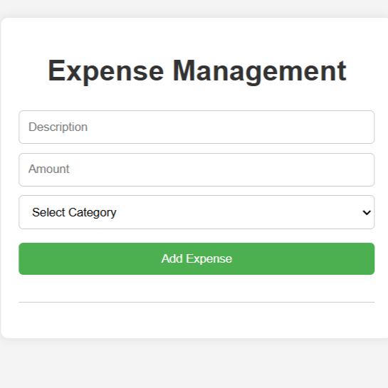
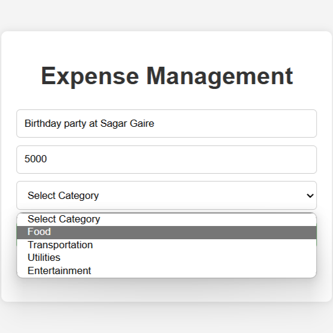

# Expense-Management-System

## Description
The Expense Management System is a comprehensive tool designed to help users manage their finances efficiently. This application allows users to track their expenses, categorize spending, and generate insightful reports. With a user-friendly interface, it simplifies the process of budgeting and financial planning, enabling users to stay on top of their financial goals. Whether for personal use or small business management, the Expense Management System offers robust features to ensure effective expense monitoring and control.

## Images

### Homepage Overview

### Expense Report

